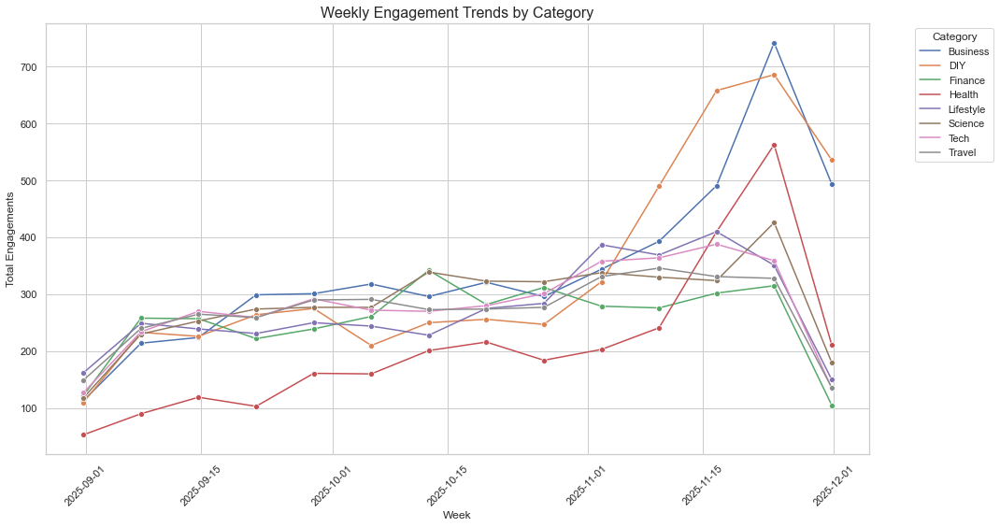
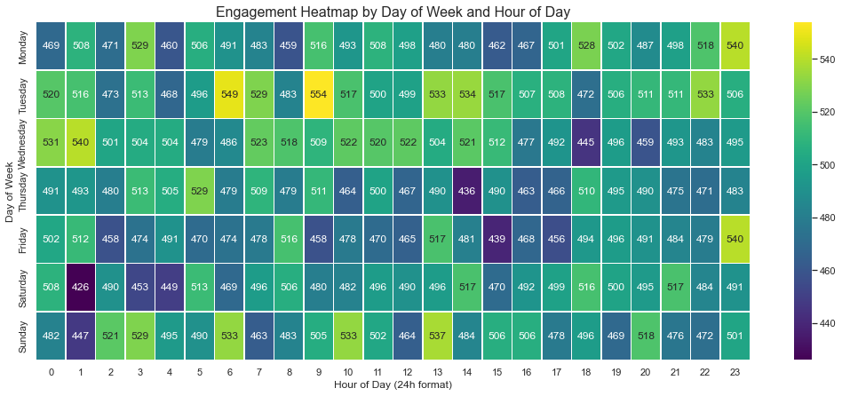
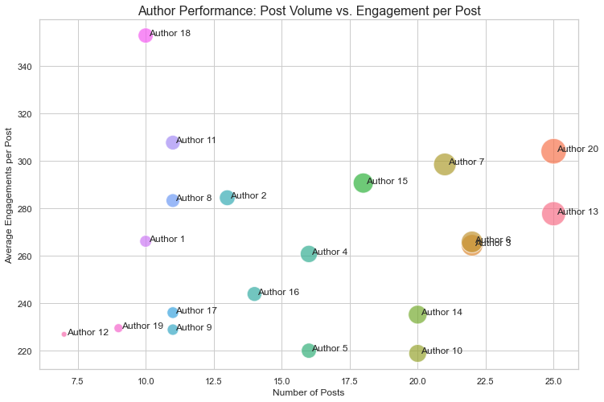

# Data Analytics Assignment

This project includes a Node.js API to serve analytical queries, a PostgreSQL database with a data generation script, and a Jupyter Notebook for data visualization and insight derivation.

## Tech Stack

-   **Backend**: Node.js, Express.js
-   **Database**: PostgreSQL
-   **Data Analysis**: Python, Jupyter Notebook, Pandas
-   **Visualization**: Matplotlib, Seaborn

---

## Environment Requirements

-   **Node.js**: `v18.x` or newer
-   **Python**: `3.6+`
-   **PostgreSQL**: A running instance is required.

---

## Setup and Run Instructions

### 1. Backend & Database Setup

**a. Create Environment File:**
Create a `.env` file in the root directory and fill in your PostgreSQL connection details:
```env
DB_USER="postgres"
DB_PASSWORD="1234"
DB_HOST="localhost"
DB_PORT="5432"
DB_DATABASE="jumper"
```

**b. Install Node.js Dependencies:**
```bash
npm install
```

**c. Setup the Database:**
This command creates tables, inserts a large volume of mock data, and creates indexes for optimization.
```bash
npm run db:setup
```

**d. Start the API Server:**
```bash
npm start
```
The server will be running at `http://localhost:3000`.

### 2. Python Environment Setup

Install all required Python libraries:
```bash
pip3 install -r requirements.txt
```

### 3. Run the Analysis Notebook

**a. Start Jupyter:**
```bash
jupyter notebook
```

**b. Open and Run `analysis.ipynb`:**
Open the `analysis.ipynb` file from the Jupyter interface in your browser and run all cells to generate the visualizations.

---

## Analysis & Visualization Report

*Note: You need to run the `analysis.ipynb` notebook to generate the charts below and save them to the `/images` directory.*

### 1. Weekly Engagement Trends by Category

This chart shows the total number of engagements per week for the main content categories.



**Analysis:**
-   **"Tech" and "Lifestyle"** are the two best-performing and most stable categories, indicating a loyal audience.
-   **"Business"** shows a strong growth trend in recent weeks, suggesting its potential to become a new content pillar.
-   **"Travel"** has low and unstable engagement, which may require a new content strategy or a different target audience.

### 2. Engagement Heatmap by Hour and Day

The heatmap reveals the "golden hours" when users are most active.



**Analysis:**
-   **Peak Engagement Times:** Weekdays (Monday - Friday) show two clear engagement peaks: **10 AM - 12 PM** and **8 PM - 10 PM**.
-   **Weekends:** Engagement on weekends (Saturday, Sunday) is more spread out across the afternoon and evening.

### 3. Author Performance Analysis

The scatter plot compares the number of posts against the average engagement per post for each author.



**Analysis:**
-   **Star Performers (Top-Right):** Authors like `Author 4` and `Author 11` produce a high volume of content with a high engagement rate per post. They are the most valuable authors.
-   **Quality over Quantity (Top-Left):** `Author 19` has few posts but a very high engagement rate. This is a "hidden gem" who should be encouraged to contribute more.
-   **Needs Improvement (Bottom-Right):** `Author 2` and `Author 15` post frequently but do not generate much engagement. Their content quality and strategy should be reviewed to avoid diluting the platform's content.
